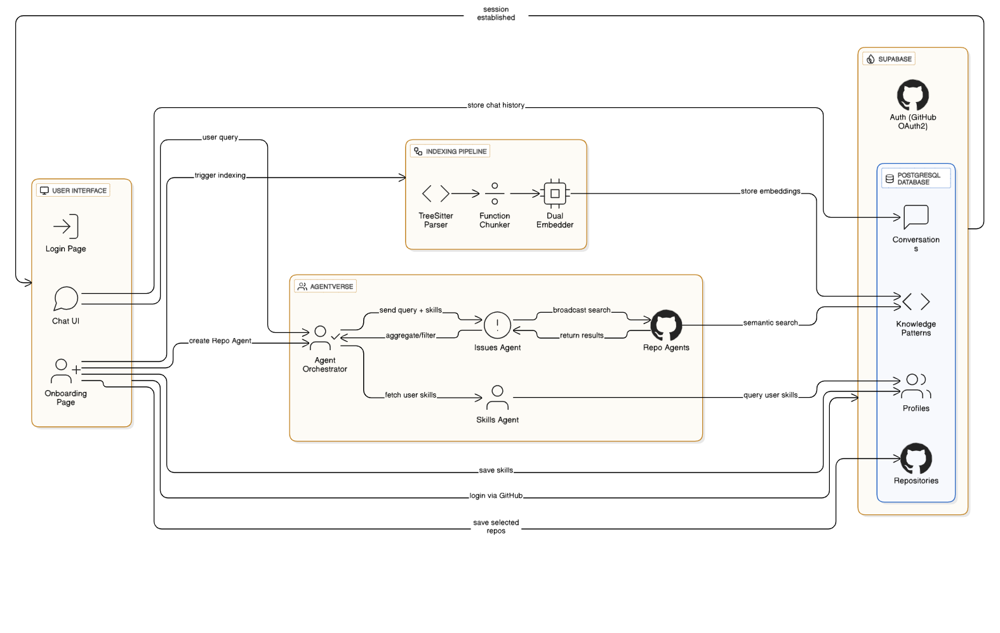

# Bee2Bee

> AI-powered codebase analysis and repository intelligence platform for developers

[](https://opensource.org/licenses/MIT)
[](frontend/package.json)
[](https://ethglobal.com/)

## Overview

Bee2Bee is an intelligent platform that helps developers understand, analyze, and interact with their codebases through AI-powered conversations. It provides deep repository insights, code comprehension, and contextual answers by indexing your repositories and leveraging advanced language models.

## Key Features

- **🤖 AI-Powered Code Chat** - Conversational interface for querying and understanding your codebase
- **📦 Multi-Repository Support** - Analyze and chat with multiple repositories simultaneously
- **🔍 Intelligent Code Search** - Semantic search across your entire codebase with context-aware results
- **📊 Repository Analytics** - Complexity scoring, language distribution, and codebase insights
- **🎯 Source Code Citations** - AI responses include direct references to relevant code sections
- **🌿 Branch Management** - Switch and analyze different branches of your repositories
- **⭐ Favorites & Organization** - Star and organize your most important repositories
- **🎨 Modern UI/UX** - Clean, responsive interface with dark mode support

## Architecture

Bee2Bee follows a modular monorepo architecture:

```
bee2bee/
├── frontend/              # Next.js frontend application
│   ├── src/
│   │   ├── app/          # Next.js 14 App Router pages
│   │   ├── components/   # React components
│   │   ├── hooks/        # Custom React hooks
│   │   ├── lib/          # Utility libraries (Agentverse tools, etc.)
│   │   └── integrations/ # Supabase client/types/hooks
│   └── public/           # Static assets
├── agents/                # Python agents (uAgents + MeTTa)
│   └── repository-analyzer/
├── supabase/              # Supabase config + migrations
└── n8n/                   # n8n + ngrok (optional)
```

<p align="center">
  
</p>

### Technology Stack

| Layer                  | Technology                  |
| ---------------------- | --------------------------- |
| **Frontend Framework** | Next.js 14 (App Router)     |
| **Language**           | TypeScript                  |
| **Styling**            | Tailwind CSS                |
| **UI Components**      | shadcn/ui + Radix UI        |
| **State Management**   | React Hooks                 |
| **AI Integration**     | Vercel AI SDK               |
| **Markdown Rendering** | react-markdown + remark-gfm |
| **Animations**         | Framer Motion               |
| **Package Manager**    | pnpm 9.12.0                 |

## Quick Start

### Prerequisites

- Node.js 18.14+ or 20.x
- pnpm 9.12.0+
- Docker Desktop (for local database)
- Supabase CLI (install with: `npx supabase --version`)

### Installation

### 1) Install dependencies

```bash
# From repository root
cd frontend
pnpm install
```

### 2) Configure environment

```bash
# Create frontend env
cp .env.example .env.local
```

For local database, enable the local toggle used by the Supabase client ([frontend/src/integrations/supabase/client.ts](frontend/src/integrations/supabase/client.ts)):

```env
# frontend/.env.local
NEXT_PUBLIC_USE_LOCAL_SUPABASE=true
# Optional (for chat/tools):
ASI_ONE_API_KEY=your-asi-one-api-key
AGENTVERSE_API_KEY=your-agentverse-api-key
```

### 3) Start local database (Supabase)

Use the scripts defined in [frontend/package.json](frontend/package.json):

```bash
# From repository root (or inside frontend/)
cd frontend

# Start Supabase containers (DB, API, Studio)
pnpm supabase:start

# Apply local migrations and seed (drops/recreates)
pnpm supabase:reset

# (Optional) Generate TypeScript types from DB schema
pnpm supabase:gen-types
```

Notes:

- Studio URL: http://localhost:54323 (configured in [supabase/config.toml](supabase/config.toml))
- The frontend Supabase client automatically points to http://127.0.0.1:54321 when `NEXT_PUBLIC_USE_LOCAL_SUPABASE=true` (see [frontend/src/integrations/supabase/client.ts](frontend/src/integrations/supabase/client.ts))

### 4) Run the app

```bash
# From repository root
cd frontend
pnpm dev
# Visit http://localhost:3000
```

## Development

### Available Commands

```bash
# Frontend development
cd frontend

pnpm dev          # Start development server (port 3000)
pnpm build        # Build for production
pnpm start        # Start production server
pnpm lint         # Run ESLint
```

## Configuration

### pnpm Workspace

This project uses pnpm workspaces for efficient dependency management. The `packageManager` field in `package.json` ensures everyone uses the same pnpm version:

```json
{
  "packageManager": "pnpm@9.12.0+sha512.4abf725084d7bcbafbd728bfc7bee61f2f791f977fd87542b3579dcb23504d170d46337945e4c66485cd12d588a0c0e570ed9c477e7ccdd8507cf05f3f92eaca"
}
```

## Local Database (Supabase)

- Config: [supabase/config.toml](supabase/config.toml)
- Migrations: [supabase/migrations/](supabase/migrations/)
- Frontend Supabase client and types:
  - Client toggle: [frontend/src/integrations/supabase/client.ts](frontend/src/integrations/supabase/client.ts)
  - Types (auto-generated): [frontend/src/integrations/supabase/types.ts](frontend/src/integrations/supabase/types.ts)

Workflow:

1. Start DB: `pnpm supabase:start`
2. Apply schema locally: `pnpm supabase:reset`
3. Regenerate types after schema changes: `pnpm supabase:gen-types`
4. Run app: `pnpm dev`

For advanced details, see [supabase/README.md](supabase/README.md).

### Tailwind Configuration

Custom theme extensions for Bee2Bee branding and shadcn/ui integration can be found in `frontend/tailwind.config.ts`.

## License

MIT License - see [LICENSE](LICENSE) file for details.

## Acknowledgments

- Built with [Next.js](https://nextjs.org)
- UI components from [shadcn/ui](https://ui.shadcn.com)
- Icons from [Lucide](https://lucide.dev)
- AI SDK by [Vercel](https://sdk.vercel.ai)

---

Built for **ETHOnline 2025**
